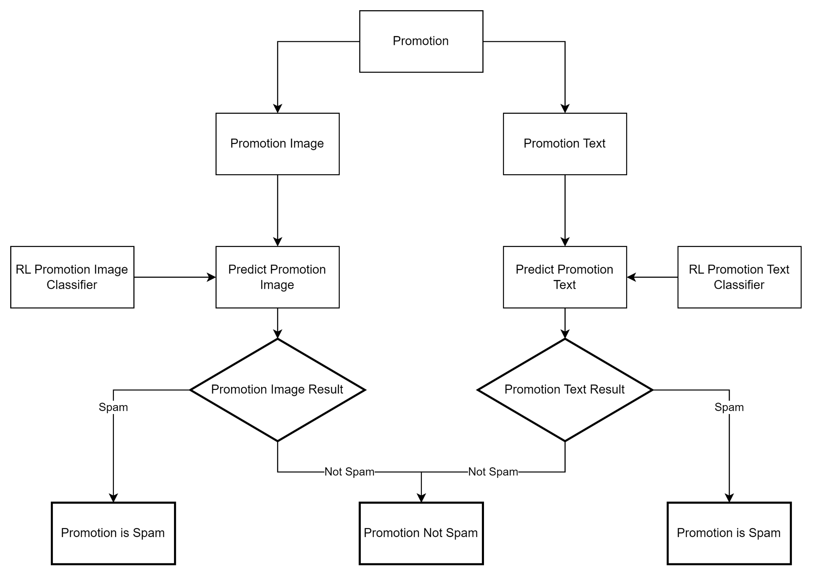

# RL-Improve-Promotion-Section

## Introduction
This README provides an overview of the promotion section improvement tasks at Wongnai.

## Description
The assignment focuses on enhancing the promotion section on Wongnai, a platform allowing users to upload restaurant promotions comprising images, text, or both. Some promotions may consist of either text or image, while others may include both.

You can explore promotions in our system [here](https://www.wongnai.com/promotions).

## Virtual Environments
To use the virtual environment, perform these two steps:
1. In the CLI, run the following command `py -m poetry config virtualenvs.in-project true`
2. Run `py -m poetry install`
3. Select the VSCode Kernel to be `.venv`

## Assignments
As a Data Scientist at Wongnai, you are tasked with completing two sub-assignments within a limited time frame of 7 days while ensuring optimal results.

### 1. Spam Promotion Detection
Identify and remove spam promotions based on predefined criteria, including:
- Alcohol-related promotions
- Promotions featuring people images
- Promotions displaying storefronts
- Promotions lacking detail
- Promotions related to loyalty programs
- Promotions captured as screenshots

You are provided with a labeled training set to build a predictive model. The model should classify promotions as spam or non-spam based on image and description data. Some promotions may lack description data, consisting solely of images.

#### Tasks:
1. Develop a predictive model to classify promotions as spam or non-spam.
2. Utilize the model to predict spam promotions in the testing set.

[Download example promotion images and descriptions](https://drive.google.com/file/d/13zvKkwNVjpn9Jfy6gLNrDcepEnD1NfSM/view?usp=sharing)

### 2. Recommendation Systems in Promotions
Enhance user engagement by recommending promotions tailored to individual preferences. Given the recent launch of the promotion feature, data availability is limited.

#### Tasks:
- Implement a recommendation system for promotions, considering the relatively sparse data available since the launch.

## Project Map
For a visual representation of the project, refer to the local project map `map.png` included in this repository.

     

## Project Working Tools
1. [Google Cloud](https://drive.google.com/drive/u/1/folders/17CYqR1HEH7c-nXpNSV_3hrtgbfNegRzF)

## Conclusion
These assignments aim to improve user experience and engagement on Wongnai's promotion section through spam detection and personalized recommendations.

